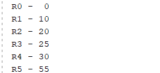
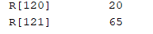
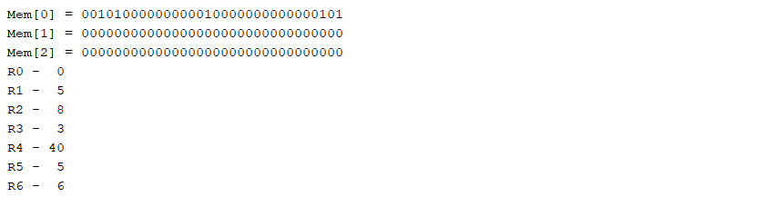

# MIPS Project

## Introduction to MIPS

MIPS (Microprocessor without Interlocked Pipeline Stages) is a Reduced Instruction Set Computer (RISC) architecture renowned for its simplicity and efficiency. Its characteristics make it a popular choice for educational purposes and embedded systems. This project involves working with MIPS assembly language, typically by simulating or implementing MIPS programs.

A common step in MIPS development is converting assembly code into a `.hex` format. This format is used to load programs into MIPS simulators or hardware implementations. The `.hex` file represents the program's instructions in a hexadecimal format suitable for memory loading.

## 5-Stage Pipeline

The MIPS architecture often employs a 5-stage pipeline to enhance performance. This pipeline consists of the following stages:

1.  **Instruction Fetch (IF):** Fetches the instruction from memory.
2.  **Instruction Decode (ID):** Decodes the instruction and reads the registers.
3.  **Execute (EX):** Performs the ALU operation.
4.  **Memory Access (MEM):** Accesses memory if required.
5.  **Write Back (WB):** Writes the result back to the register file.

Pipelining allows multiple instructions to be in different stages of execution simultaneously, thereby increasing overall throughput.

## Key Features

*   **RISC Architecture:** Simplified instruction set for faster execution.
*   **Load/Store Architecture:** Memory access is limited to load and store instructions.
*   **Fixed Instruction Length:** Instructions are typically 32 bits long.
*   **General-Purpose Registers:** MIPS has 32 general-purpose registers for storing data.

## Opcode Table (Example)

| Opcode (Hex) | Instruction | Description                                       |
| :----------- | :---------- | :------------------------------------------------ |
| `0x00`       | R-type      | Register-to-register operations (add, sub, etc.) |
| `0x02`       | `j`         | Jump                                              |
| `0x04`       | `beq`       | Branch if equal                                   |
| `0x05`       | `bne`       | Branch if not equal                               |
| `0x08`       | `addi`      | Add immediate                                     |
| `0x09`       | `addiu`     | Add immediate unsigned                            |
| `0x0c`       | `andi`      | AND immediate                                     |
| `0x0d`       | `ori`       | OR immediate                                      |
| `0x0f`       | `lui`       | Load upper immediate                              |
| `0x23`       | `lw`        | Load word                                         |
| `0x2b`       | `sw`        | Store word                                        |
| `0x3f`       | `halt`      | Halt Instruction (custom)                         |

> **Note:** This table is not exhaustive. Extend it based on the specific instructions used in your project. Refer to a comprehensive MIPS reference for a complete listing.

## File Structure

This project's file structure is organized for clarity and maintainability.

**Description of Directories:**

*   **`src/`**: Contains MIPS assembly source code files (`.s` or `.asm`). `main.s` is the program's entry point.

    *   **Usage**: Place MIPS assembly source code files here.

*   **`include/`**:  For header or include files used by assembly code, containing definitions, macros, or common code snippets.

    *   **Usage**: Store `.inc` or `.h` files with common definitions or macros.

*   **`lib/`**: Contains any pre-built libraries your project uses.

    *   **Usage**: Place any library files here.

*   **`build/`**: Stores build artifacts like object files and executables.

    *   **Usage**: Contains the output of the assembler and linker.

*   **`docs/`**: Holds project documentation, including the `README.md` file and supporting documents.

    *   **Usage**: Keep all documentation files in this directory.

*   **`examples/`**: Contains example MIPS programs.

    *   **Usage**: Place example MIPS programs here for reference.

*   **`README.md`**: This file, providing an overview of the project.

*   **`LICENSE`**: Contains licensing information for the project.

## Example Programs

### Example 1: Basic Arithmetic and Jump

This example demonstrates basic arithmetic operations and the `jal` (jump and link) instruction.

**Code:**

| Line | Instruction       | Description                                     | Effect                    |
|------|-------------------|-------------------------------------------------|---------------------------|
| 0    | `addi $1, $0, 10` | Initialize register `$1` with the value 10     | `$1 = 10`                 |
| 1    | `addi $2, $0, 20` | Initialize register `$2` with the value 20     | `$2 = 20`                 |
| 2    | `addi $3, $0, 25` | Initialize register `$3` with the value 25     | `$3 = 25`                 |
| 3    | `jal subroutine`  | Jump to subroutine                             | Jump to `subroutine`      |
| 4    | `add $4, $1, $2`  | Add the contents of registers `$1` and `$2`     | `$4 = $1 + $2 = 30`       |
| 5    | `add $5, $4, $3`  | Add the contents of registers `$4` and `$3`     | `$5 = $4 + $3 = 55`       |
| 6    | `halt`            | Halt the program                                | End program               |

**Example Output:**

> **Note:** Replace `output/example1_output.png` with the actual output of the program if run in a simulator or on actual hardware. Include an image if possible.

### Example 2: Basic Arithmetic Operations

This example demonstrates more basic arithmetic operations.

**Code:**

| Address | Hex Instruction | Binary                                                         | MIPS Assembly      | Description                                        | Effect           |
|---------|-----------------|-----------------------------------------------------------------|--------------------|----------------------------------------------------|------------------|
| 0       | `0x28010078`    | `0010 1000 0000 0001 0000 0000 0111 1000`                     | `addi $1, $0, 120` | Add immediate 120 to `$0`, store in `$1`        | `$1 = 120`       |
| 1       | `0x0cc77800`    | `0000 1100 1100 0111 0111 1000 0000 0000`                     | `nop`              | No Operation                                       | No effect        |
| 2       | `0x20220000`    | `0010 0000 0010 0010 0000 0000 0000 0000`                     | `add $2, $1, $2`   | Add registers `$1` and `$2`, store in `$2`        | `$2 = $1 + $2`    |
| 3       | `0x0cc77800`    | `0000 1100 1100 0111 0111 1000 0000 0000`                     | `nop`              | No Operation                                       | No effect        |
| 4       | `0x2842002D`    | `0010 1000 0100 0010 0000 0000 0010 1101`                     | `addi $2, $2, 45`  | Add immediate 45 to `$2`, store in `$2`           | `$2 = $2 + 45`    |
| 5       | `0x0cc77800`    | `0000 1100 1100 0111 0111 1000 0000 0000`                     | `nop`              | No Operation                                       | No effect        |
| 6       | `0x24220001`    | `0010 0100 0010 0010 0000 0000 0000 0001`                     | `addiu $2, $1, 1` | Add immediate unsigned 1 to `$1`, store in `$2`   | `$2 = $1 + 1`     |
| 7       | `0x0cc77800`    | `0000 1100 1100 0111 0111 1000 0000 0000`                     | `nop`              | No Operation                                       | No effect        |
| 8       | `0xFC000000`    | `1111 1100 0000 0000 0000 0000 0000 0000`                     | `halt`             | Halt instruction (custom)                          | End program      |

**Example Output:**

> **Note:** Replace `output/example2_output.png` with the actual output of the program if run in a simulator or on actual hardware. Include an image if possible.

### Example 3: Conditional Branching

This example demonstrates conditional branching using `beq` (branch if equal) instruction.

**Code:**

| Line | Instruction       | Description                                                     | Effect                                   |
|------|-------------------|-----------------------------------------------------------------|------------------------------------------|
| 0    | `addi $1, $0, 5`  | Initialize register `$1` with the value 5                     | `$1 = 5`                                 |
| 1    | `addi $2, $0, 10` | Initialize register `$2` with the value 10                    | `$2 = 10`                                |
| 2    | `beq $1, $2, else`| Branch to `else` if `$1` equals `$2`                          | Jump to `else` if `$1 == $2`            |
| 3    | `addi $3, $0, 1`  | If `$1` != `$2`, initialize `$3` with 1                      | `$3 = 1` if `$1 != $2`                   |
| 4    | `j endif`         | Jump to `endif`                                                | Jump to `endif`                          |
| 5    | `else:`           | Label `else`                                                    |                                          |
| 6    | `addi $3, $0, 2`  | If `$1` == `$2`, initialize `$3` with 2                      | `$3 = 2` if `$1 == $2`                   |
| 7    | `endif:`          | Label `endif`                                                   |                                          |
| 8    | `add $4, $3, $1`  | Add the contents of registers `$3` and `$1`                   | `$4 = $3 + $1`                           |
| 9    | `halt`            | Halt the program                                                | End program                              |

**Example Output:**

> **Note:** Replace `output/example3_output.png` with the actual output of the program if run in a simulator or on actual hardware. Include an image if possible.

